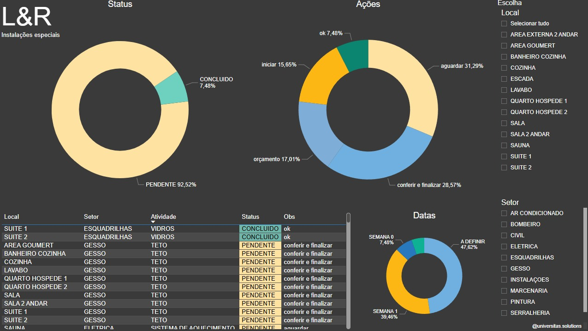

Interactive dashboard creation service for data visualization and analysis using tools such as `Power BI`, `Tableau`, `Google Data Studio`, and other Business Intelligence platforms.

We offer tailored solutions to transform your data into clear and impactful visual insights, making strategic decision-making easier. Our dashboards are designed to be intuitive and easy to use, allowing you to explore your data efficiently and effectively.

- Creation of custom dashboards for data visualization.
- Data integration from multiple sources for a complete view.
	- Excel, Google Sheets, SQL databases, APIs, etc.
- Real-time data analysis for continuous monitoring.
- Interactive visualizations to facilitate data exploration.
- Support in data interpretation and strategic decision-making.

[Get in touch](mailto:geraldohomero+universitas@pm.me) to discuss your specific needs and how we can help you in the best possible way.

---

## Examples of Dashboards Created

