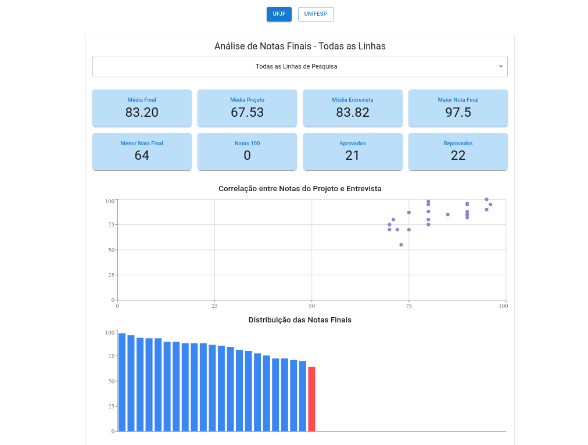
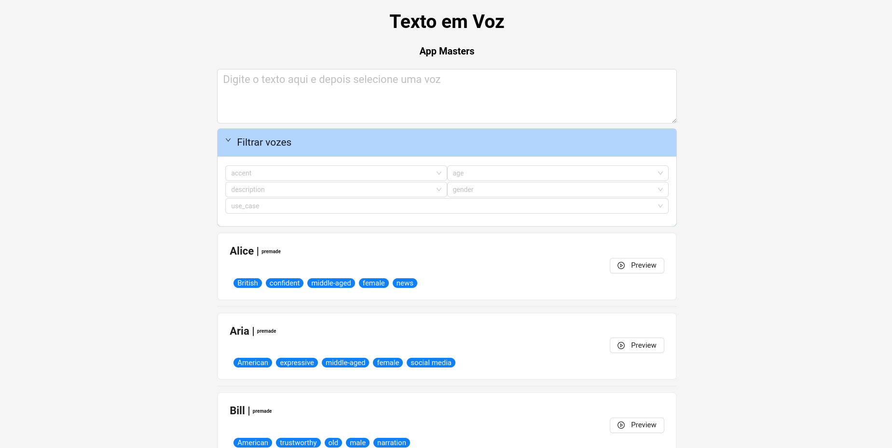

Custom academic website creation service for researchers, professors, and students. The service includes responsive design, search engine optimization (SEO), and integration with academic platforms. It is ideal for showcasing publications, projects, and your CV in a professional and accessible way.

[Contact us](mailto:geraldohomero+universitas@pm.me) for more information and personalized quotes.

We currently offer three service categories based on maintenance complexity, so you can choose the option that best fits your needs and management preferences:

---

### 1. Easy Maintenance
Ideal for those looking for practicality. You can update content independently through intuitive visual dashboards, without touching code.

- **Technologies:** WordPress, Wix, or Squarespace.
- **Hosting:** Client's choice or based on our recommendation.
- **Included:** Design creation, initial setup, and management training.
- **Technical Support (Optional):** Rates discussed separately.

---

### 2. Intermediate (Static)
For those familiar with technology. Ultra-fast websites with Markdown-based content management and versioning via GitHub.

- **Modern Technologies:** Hugo, Astro, or Jekyll.
- **Hosting:** Highly flexible (GitHub Pages, Netlify, Vercel, etc.).
- **Included:** Repository setup and a complete tutorial for updates via Markdown.
- **Technical Support (Optional):** Rates discussed separately.

---

### 3. Advanced & Custom
Complex, tailored web solutions for research projects that require specific features, dashboards, or databases.

- **Cutting-edge Technologies:** JavaScript (React, Next.js) or C# (ASP.NET).
- **Included:** Full-stack development and 6 months of guaranteed support after implementation.
- **Additional Support (after 6 months):** Rates discussed separately.

---

> **We issue invoices** for both individuals and companies. [Contact us](mailto:geraldohomero+universitas@pm.me) for a personalized quote.

---

## Examples of Academic Websites Created

### [II Graduate Student Seminar of the Unicamp Political Science Program (2025)](https://seminariodiscenteppgcp.wordpress.com/)

### [Selection Process Analysis Website](https://processo-seletivo-2024-2025.vercel.app/)

### [Professional Academic Website](https://geraldohomero.github.io/)

### [Text-to-Speech](https://app-masters-elevenlabs-project.vercel.app/)

